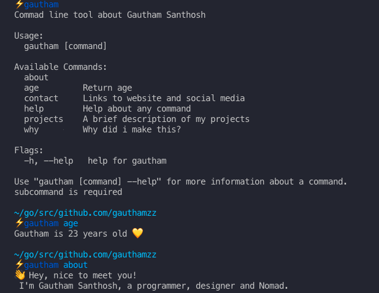

# Gautham Santhosh CLI ⚡️tool

## Install

`go get github.com/gauthamzz/gautham`

## Usage


```Commad line tool about Gautham Santhosh

Usage:
  gautham [command]

Available Commands:
  about
  age         Return age
  contact     Links to website and social media
  help        Help about any command
  projects    A brief description of my projects
  why         Why did i make this?

Flags:
  -h, --help   help for gautham

Use "gautham [command] --help" for more information about a command.
subcommand is required
```



